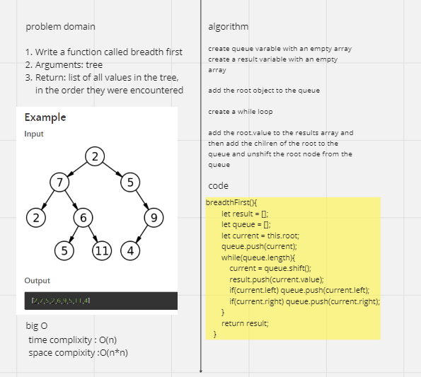

Documentation: Your README.md
Use the template below to create your own README.md file.

# Breadth-first Traversal.

<!-- Description of the challenge -->

## Whiteboard Process
<!-- Embedded whiteboard image -->

